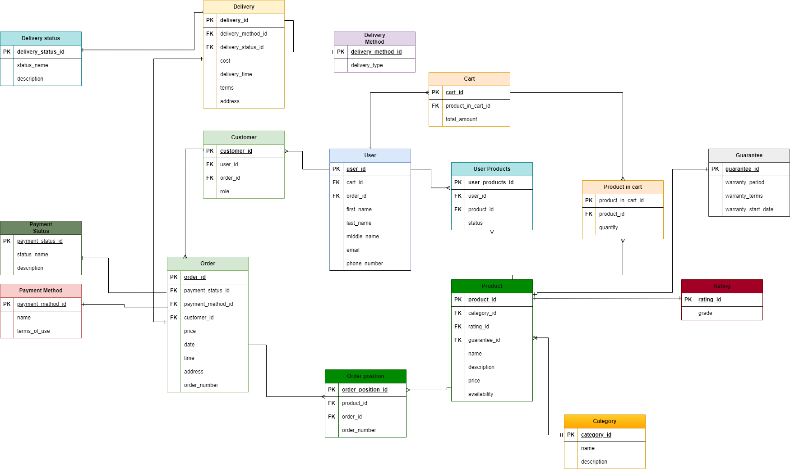
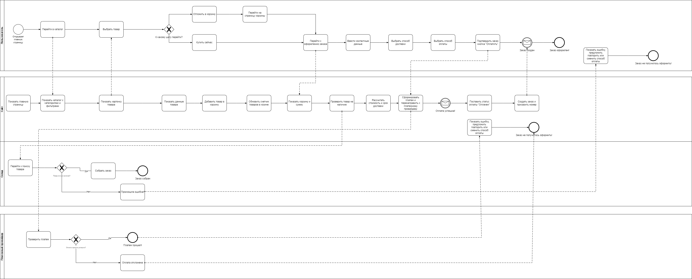

# HITECH — интернет‑магазин бытовой техники

Проект системной модернизации веб‑сайта HITECH для повышения конверсии, лояльности клиентов  
и масштабирования онлайн‑продаж за счёт улучшения UX, функционала и интеграций.

---

## О проекте

- Домашняя техника и электроника, формат: интернет‑магазин  
- Роль: системный аналитик  
- Сроки: 3 месяца  
- Цель: оптимизировать пользовательский путь от входа на сайт до оформления заказа  
  и подготовить масштабируемую архитектуру для дальнейшего развития продукта.

---

## Прототипы интерфейсов

Интерактивные прототипы были разработаны в Figma для ключевых пользовательских сценариев:  
главная страница, каталог, карточка товара и корзина.

[Прототип (PDF)](https://disk.yandex.ru/d/PYoSam6aLT5Rgg)

- Чёткая структура каталога и фильтров.  
- Упрощённый путь к оформлению заказа с минимумом полей и шагов.

---

## Модель данных (ER‑диаграмма)

Для поддержки каталога, заказов и отзывов спроектирована ER‑диаграмма 
(«User», «Customer», «Order», «Delivery» и др.).

  

Ключевые решения:

- Разделение товарного каталога, заказов и пользовательских данных для масштабируемости.  
- Подготовка базы для аналитики (история заказов, статусы, источники трафика).

---

## Бизнес‑процессы (BPMN)

Описаны и формализованы три критически важных процесса:

- «Оформление заказа»  
- «Возврат товара»  
- «Обработка заявки»  

  

- Процессы показывают роли (клиент, сайт, склад) и точки интеграций.  
- Зафиксированы статусы, условия переходов и уведомления для клиента.

---

## REST API и документация (Swagger)

Для взаимодействия фронтенда и бэкенда спроектирован REST API (12 эндпоинтов) и описан в Swagger.

  
  
  
  
  

Примеры групп эндпоинтов:

- DELETE /api/v1/cart/{itemId} — удалить товар из корзины.  
- GET /api/v1/cart/summary — получить сводную информацию о корзине (общая сумма, количество товаров). 
- POST /api/v1/cart/apply-discount — применить промокод/скидку к корзине.  
- GET /api/v1/products/{id}/specifications — получить детальные характеристики товара  

Для каждого эндпоинта описаны:

- структура запроса и ответа,  
- коды ошибок,  
- требования к валидации и авторизации.

---

## Аналитические артефакты

В рамках проекта были выполнены следующие задачи:

- Аудит текущего сайта: выявлены узкие места в UX и технические ограничения.  
- Анализ 3 конкурентов и отбор лучших практик для каталога, поиска и корзины.  
- Список требований к доработке (23 пункта) с приоритизацией.  
- Выделение MVP: каталог, корзина, форма заказа, личный кабинет.  
- 45 тест‑кейсов для ключевых пользовательских путей.  
- Словарь данных из 40 терминов и инструкция для администраторов сайта.

---

## Результаты проекта

- Количество заявок увеличилось на **60 %**.  
- Время оформления заказа сократилось с **3,5 мин до 1,2 мин**.  
- Среднее время на сайте выросло с **2 мин до 4,5 мин**.  
- Интеграция CMS ускорила работу с контентом и бизнес‑процессами.  
- Сайт стал адаптивным и корректно работает на всех типах устройств.

---

## Технологии и инструменты

- Аналитика и моделирование: **BPMN, ER‑диаграммы, словарь данных, тест‑кейсы**  
- API: **REST, Swagger / OpenAPI, JSON, HTTP**  
- Интерфейсы: **Figma**  
- Управление и документация: **Jira, Confluence, CMS**  
